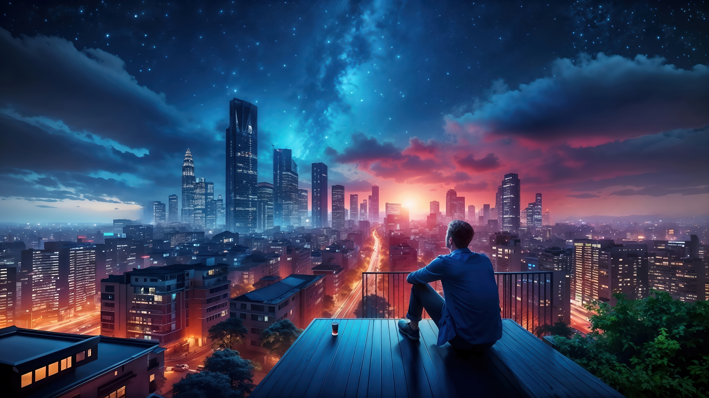

# 🌄 A Glimpse of Nature's Beauty

> "The earth has music for those who listen." — William Shakespeare

---

  

---

### 🖼️ About the Scene

This breathtaking landscape captures the serenity and grandeur of nature. The blend of colors, the vast open skies, and the peaceful vibe make it a truly captivating view.

---

### 📍 Why It Inspires

- A reminder of the beauty beyond screens and walls  
- Encourages mindfulness and appreciation  
- Refreshes the mind and soul  

---

✨ *Take a deep breath. Let your eyes wander. Let the landscape speak.*

